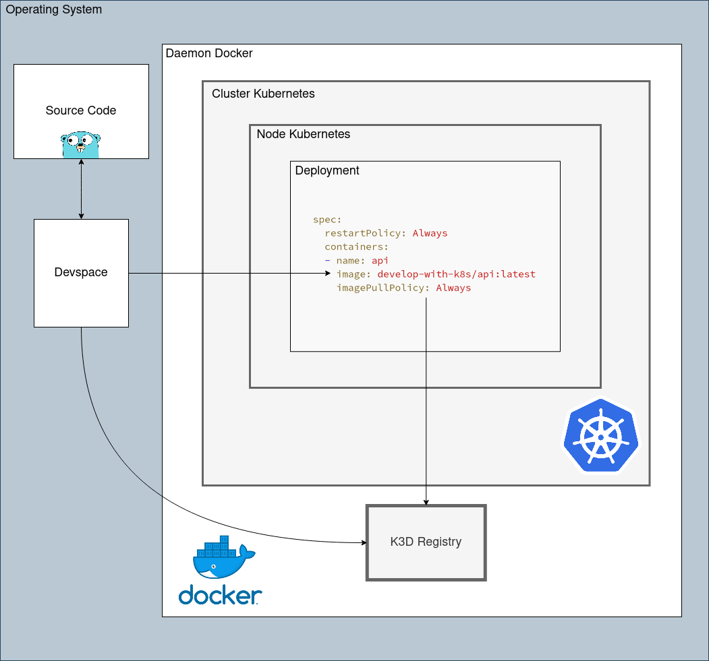

# Develop With K8s and Golang

This repository shows you how to locally develop your application inside local Kubernetes cluster with auto-reload


## Prerequisites


## How it works



## How to

1. Create your cluster

    ```bash
    make start
    ```

2. Deploy API

    ```bash
    make deploy
    ```

3. Run API in development mode

    ```bash
    make dev
    ```

## Cleanup your system

1. Remove all docker images generated by this project
    ```bash
    make cleanup-images
    ```

2. Stop your cluster and your registry
    ```bash
    make stop
    ```

3. delete your cluster but keep your registry
    ```bash
    make delete
    ```

4. delete everything in your system about this project
    ```bash
    make cleanup
    ```
